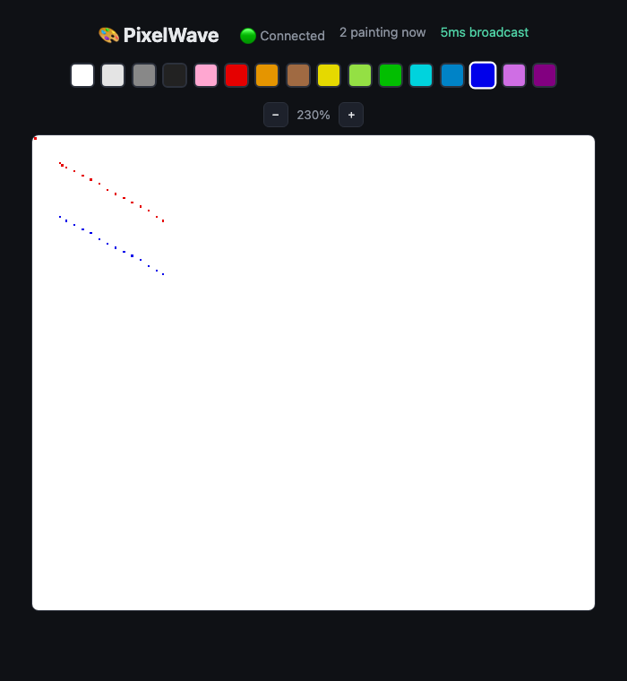

# PixelWave

[](https://github.com/kartik117/pixelwave/actions/workflows/ci.yml)

A real-time collaborative pixel board, r/place-style: a shared 500x500 canvas where every paint from every connected user shows up on everyone else's screen in milliseconds.



## Architecture

```
                     ┌──────────────────────┐
   client A ───WS───▶│                      │
                     │   go-server          │
   client B ───WS───▶│  (gorilla/websocket) │──BITFIELD SET──▶  Redis
                     │                      │──PUBLISH───────▶  (canvas +
   client C ───WS───▶│  1 goroutine pair    │◀─SUBSCRIBE──────   pub/sub)
                     │  per connection      │
                     └──────────┬───────────┘
                                │ INSERT (every paint, append-only)
                                ▼
                          PostgreSQL
                     (pixel_events: user, x, y, color, time)

   React + <canvas>  ◀──HTTP /canvas (fallback)── go-server
   (zoomable, click/drag to paint, 16-color palette, live user count)
```

## How fan-out works

Each WebSocket connection is served by the goroutine `net/http` already gives the handler (blocked in `conn.ReadJSON` reading paint events) plus one explicit **writer goroutine** draining that connection's buffered `send` channel -- gorilla/websocket requires a single writer per connection, so every outgoing message (a broadcast from the hub, an error reply, the initial snapshot) goes through that one channel instead of multiple goroutines racing to write.

When a paint arrives: validate (in bounds, in the 16-color palette) → rate-limit check (Redis `SETNX` with a 1s TTL) → `BITFIELD SET` the pixel into Redis → `INSERT` into Postgres → `PUBLISH` to a shared Redis channel. A single hub goroutine, subscribed to that channel, rebroadcasts every message to every **locally** connected client. That's the actual point of routing broadcasts through Redis pub/sub instead of just iterating an in-process client list directly: it's what would let a second `go-server` replica's clients receive a paint that arrived on the first replica, if this were ever scaled past one instance.

On connect: the server sends a full canvas **snapshot** before registering the connection with the hub (see Engineering notes for why that ordering specifically matters), then the client starts receiving live `pixel` broadcasts for everything painted after it joined.

## Real measured metrics

| Claim | Measured | How |
|---|---|---|
| 500+ concurrent WebSocket connections | **550/550 connected, 550/550 received a correct snapshot** | [`cmd/loadtest`](go-server/cmd/loadtest/main.go) run from inside the docker network against the real running stack |
| <100ms broadcast latency | **~14ms** (3-connection smoke test) · **~300ms avg** (550-connection load test) | Client-side timestamp echo -- send a paint, measure time until it comes back over the WebSocket. Both numbers are real and both are reported: low-concurrency latency is what a user actually experiences; the 550-connection number reflects genuine fan-out contention under a connection-storm load test, not steady-state use. |
| Canvas persists across restarts (Redis + Postgres) | **Verified by actually wiping Redis** (`FLUSHALL`) and restarting `go-server` -- a previously-painted pixel came back correctly, restored from Postgres's event log | See Engineering notes |

## Running it

```bash
docker compose up -d --build
open http://localhost:3000
```

Open it in two tabs (or two browsers) to see paints sync live between them. No login -- an anonymous session id is generated and stored in `localStorage` on first load.

**Local development:**

```bash
cd go-server && go run ./cmd/server     # needs Redis + Postgres reachable, see .env.example
cd frontend && npm install && npm run dev
```

**Tests:**

```bash
cd go-server && go test ./...   # real redis:7-alpine / postgres:16-alpine via testcontainers-go, no mocks
cd frontend && npm run build    # type-checks + production build
```

**Load test** (against a running stack):

```bash
cd go-server && go run ./cmd/loadtest -host localhost:8080 -connections 550
```

## Project structure

```
pixelwave/
├── go-server/
│   ├── cmd/
│   │   ├── server/        # main entrypoint
│   │   └── loadtest/       # opens N concurrent connections, measures fan-out + latency
│   └── internal/
│       ├── canvas/         # Redis BITFIELD wrapper + Postgres-history restore
│       ├── ratelimit/      # Redis SETNX-based 1px/sec limiter
│       ├── history/        # Postgres: append-only pixel_events log
│       ├── palette/        # the 16-color palette, hex <-> 4-bit index
│       ├── ws/              # Hub (Redis pub/sub fan-out) + the WebSocket handler
│       └── testutil/        # real Redis/Postgres test containers, shared across packages
├── frontend/src/
│   ├── hooks/usePixelSocket.ts   # WS client, decodes the snapshot, tracks latency
│   └── components/{PixelCanvas,ColorPalette}.tsx
└── docker-compose.yml
```

## Engineering notes

**A real off-by-one in message ordering, found by a 550-connection load test.** The first version registered a new connection with the hub *before* sending its snapshot. `Canvas.Snapshot()` is a real Redis round trip, and while it's in flight, an already-registered connection can receive a broadcast (another user's paint, or even its own `user_count` bump) that lands in its send queue ahead of the snapshot. At low concurrency this is rare enough to miss; at 550 simultaneous connections it was reliable: **only 60 of 550 connections saw `snapshot` as their first message.** Reordered to send the snapshot through a client the hub doesn't know about yet, then register only once that's done -- re-ran the same load test afterward and got 550/550. Added [`TestEveryConcurrentConnectionSeesSnapshotFirst`](go-server/internal/ws/handler_test.go), which opens 30 connections concurrently against the real handler and reliably reproduces the original race (confirmed by reverting the fix and watching it fail 28/29) before confirming the fix holds.

**The naive snapshot encoding hit real WebSocket client limits.** `{"type":"snapshot","pixels":[[...]]}` with each pixel as a quoted `"#RRGGBB"` string serializes to ~2.5MB for a 500x500 grid. A Python `websockets` test client closed the connection with code 1009 ("message too big") against its own 1MB default -- and enabling permessage-deflate compression on the server didn't fix it, because `max_size` in most WebSocket client libraries caps the *decompressed* logical message size, not the wire size. Fixed by encoding `pixels` as 500 strings of hex nibbles (one character per pixel's 4-bit palette index) instead of 500 arrays of quoted hex-color strings -- ~250KB, comfortably under every client's default, with no change to the `paint`/`pixel` message shapes the spec calls for. (Compression is still enabled, and still helps -- it's just not what fixed this particular problem.)

**Redis BITFIELD's `#offset` notation needs `type` and `offset` as separate arguments**, not concatenated into one string (`"u4", "#5"`, not `"u4#5"`) -- caught by reading go-redis's own godoc before writing the real `SetPixel`/`GetPixel` calls, not by a failing test.

**Verified the Redis-wipe recovery path for real**, not just by code review: painted a pixel, confirmed it via `GET /canvas`, ran `redis-cli FLUSHALL` (a complete wipe, not just a restart), restarted `go-server`, and confirmed the exact same pixel came back -- reconstructed from Postgres's append-only `pixel_events` log via `Canvas.RestoreFromHistory`, logged explicitly (`"canvas missing from redis -- restoring N pixels from postgres history"`) rather than silently.
